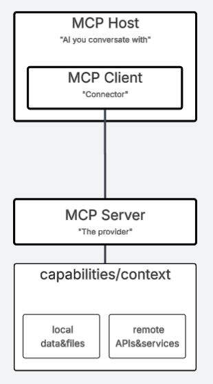

# MCP&A2A - lingua franca of AI era?
## About brand new, AI-friendly protocols for busy people like my boss

# 1. Introduction with some dose of history

> To be ignorant of the past is to be forever a child. 
> *Marcus Tullius Cicero*

## 1.1. S.P.Q.R.

If asked for an empire we would quickly come back with an answer: "Ancient Rome". The success of Roman Empire was a result of a combination of multiple factors allowing it to reach its peak during Pax Romana times (27 BCE to 128 CE). We are all aware of military power of extremely effective legions and remember from history lessons how well-organized was empire's centralized administration. Quick family visit to Rome this year shocked me as an architect (IT domain still counts) that 2 000 year old bridges might be in better shape than Polish ones from mid 20th century. On top of that, pizza in Italy tastes better. Ave!

 
*[Cestius bridge](https://en.m.wikipedia.org/wiki/Pons_Cestius) was built around 1st century BC to connect right bank of Tiber with Tiber Islanf. Even after later restorations it is today still "original" in 1/3*

## 1.2. Lingua franca

What help Romans maintain so rapid expansion  is a result of a one more, often overlooked thing - the common language.

> **lingua franca**, language used as a means of communication between populations speaking vernaculars that are not mutually intelligible.
> [*Encyclopedia Britannica*](https://www.britannica.com/topic/lingua-franca) 
> At any modern, international workplace (like EPAM) we use today English as lingua franca. Other examples are Old Church Slavonic attributed to Saint Cyril, who managed with its help to spread christanity across Slavic people. These days, in northern India people quite often use Hindi, it is also one of two official Indian languages. In Africa we have Swahili, *hakuna matata*.

Expansion through new trade routes and deep harbors was crucial for building true economic power in Mediterranean area. There is no better way to integrate conquuered people by making them capable of doing business together. Two common languages, Latin and Kone Greek (in east) helped tremendously. The empire spoke in too many native languagues to let even rich merchant posses enough number of slave translators. Oscans&Umbrians, Celts, Syrians, Berbers, Copts, Iberians Germans, Jews, Slavics - these are just a few people groups...

## 1.3. AI and "Back to the Present"

But why the beforementioned examples of Roman Empire and lingua franca are discussed in an article about MCP&A2A, two new, emerging AI protocols?
It is actually quite simple. Please let me explain.

# 2. New Kids On The Block
**Model Contenct Protocol** (MCP) and **Agent-To-Agent** (A2A - do not mistake with SAP's "application to application" integration type) are gaining recently a lot of attention. Many experts argue do we really need anything new. Many of them points at OAS/Swagger and promotes idea that AI interacts directly with APIs with no adiitional abstraction layer.

## 2.1. Solution looking for a problem
Always start with the problem and not the solution. Is seems obvious that when you create a solution first you are later forced to spend countless hours on convincing people that they need it.
Describing AI as "a solution looking for a problem" (thanks again [Vlad Grubman](https://www.linkedin.com/in/vladgrubman/)!) resonates with me. Multiple organizations are investing a lot of efforts (and money of course) to find best ways how AI can make their bussineses more profitable and competitive. 
But there are many challenges, not only data quality ("garbage-in, garbage-out"). On of the most profound are difficult integrations with complex and legacy IT infrastructure. Having trust in AI it will create a proper REST request based on partial, outdated specification seems to be a sort of a wishful thinking. Especially when most of web API are based on REST, where REST is a style and not a standard (get list of orders using POST?  Resource named as "get-Orders"? Yes, this happens).
Let's admit - it is hard to build and deploy AI applications, they simply require much custom work on letting models interact with data and users.Every case is different.

## 2.2. Solution for "solution looking for a problem" problem
As an integration architect I find very exciting exposing enterprise systems to AI agents, a completely new category of consumers. Despite having many doubts I see some wisdom in introducing new "AI-friendly" protocols, new *lingua franca* of the modern era. Latin and Koine Greek helped 2000 years ago Roman Empire to expand. Who knows? Perhaps MCP and A2A will similarily help organizations to adopt new technology more widely and with measurable outcomes.

## 2.3. New "AI-friendly" protocol? Cool, but why two?
Google in april not only confirmed support for MCP but also introduced its own (but open) Agent2Agent (A2A) protocol. According to Google's narrative it is "complementary, not competing". For certain it is not trying to overlap with MCP, the opposite is on the other hand not clear (yes agents might expose themselves through MCP).
Visual thinkers (architects?) can easily adopt an idea of tho directions, vertical and horizontal. First is MCP, A2A is the second. No to so different form "north-south" and "east-west" in network architecture. To make it more clear fo myself I even prepared an informal diagram:

# 3. Anthropic's Model Context Protocol (MCP)
MCP was open-sourced on 25th November to allow ["connecting AI systems with data sources, replacing fragmented integrations with a single protocol"](https://www.anthropic.com/news/model-context-protocol).

## 3.1. MCP Basics
Long story short. MCP let applacations provide context to AI model in a standardized way. This way agents are becoming more autonomous are no longer depend on custom implementations for data and tooling access.

## 3.2. MCP Architecture
MCP is client-server. MCP server is implemented as a lightweight interface hiding behind itself local data or remote APIs. All is prescribed rather than described. AI agent's model can interact with data and tooling with no prior need to learn how to do it.

## 3.3. MCP Components
[Protocol specification](https://modelcontextprotocol.io/introduction) is rapidly expanding. Below I summarized version 2025-06-18 (latest one when writing this article).

# 4. Google's Agent-2-Agent protocol (A2A)

## 4.1. A2A Basics

## 4.2. A2A Architecture

## 4.3. A2A Components

# 5. What If?
It is hard to be a clairvoyant. MCP seems to stay with us for a longer time. Will A2A join it? Time will tell. 

## 5.1. Scenario 1: MCP used for agent to agent communication
TODO: discuss "agentic behaviours" of MCP: samplings and elicitations.

## 5.2. Scenario 2: OAS adapts

# 6. Final word

